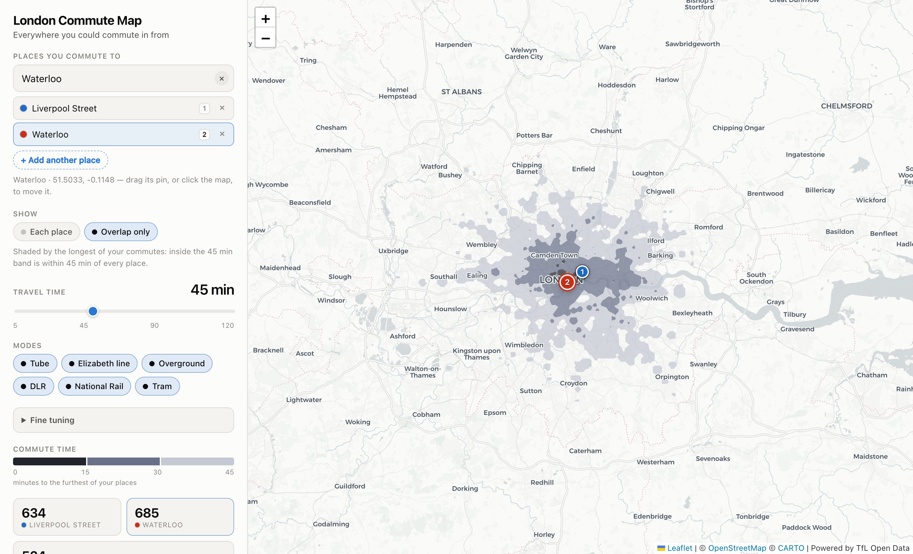

# London Commute Map

**[london-commute-map.vercel.app](https://london-commute-map.vercel.app/)**

Where could you live, given where you have to be?

Give it a London postcode, station or address — a workplace, say — and a commute
length, and it shades every part of the city you could commute in from within
that time by public transport. Add more places and each gets its own colour, so
the answer to *"where works for both of us?"* is the patch where they overlap.

Everything runs in the browser: no server, no API keys, no backend. Dragging the
time slider redraws the map immediately.


## Using it

Try it at **[london-commute-map.vercel.app](https://london-commute-map.vercel.app/)**,
or run it locally with the steps further down.

**Set a place.** Type a postcode, station or address in the search box, or just
click the map. Drag a pin to move it. This is where you're commuting *to* — the
shading is everywhere you could commute *from*.

**Add more places** with `+ Add another place`, up to five. Each takes the next
colour, and they mix where their areas overlap — the purple in the screenshot
above is where blue and red both reach. The numbered badge on each pin matches
its row in the panel.

**Two ways to view several places:**

| | |
|---|---|
| **Each place** | Every isochrone in its own colour, blended where they overlap. Good for seeing the shape of each commute. |
| **Overlap only** | One layer, shaded by the *longest* of your commutes. Everywhere inside the 45-minute band is within 45 minutes of **every** place at once. Good for actually picking a neighbourhood. |



**Hover anywhere on the map** for the real commute from that spot: a total for
every place you've added, then the selected place's journey leg by leg — walk,
wait, ride, change, walk — with each line's roundel in its own TfL colour and the
minutes for every leg. The legs always add up to the total exactly.

**Press `1`–`5`** while hovering to swap which place's route is spelled out,
without moving the cursor. Clicking a place in the panel (or its pin) does the
same thing.

**The rest of the panel:**

- **Travel time** — 5 to 120 minutes. This is a door-to-door budget, walking at
  both ends included.
- **Modes** — turn off anything you won't use. Dropping National Rail is the
  usual one; dropping everything but the Tube shows how zone-1-shaped London is.
- **Fine tuning** — walking speed, the longest walk you'd do to your first stop
  and at your destination, the penalty you feel per change, and service level
  (peak / off-peak / evening, which scales every line's waiting time).
- **Stats** — area reached per place, plus the area in range of all of them.
- **Stations in range** — everything the selected place can reach, soonest
  first. Click one to jump the map to it.

## Running it

```bash
npm install
npm run dev             # http://localhost:5173
```

`public/network.json` is committed, so this works straight away. To refresh the
network (new stations, renamed lines):

```bash
npm run build:network   # fetches from the TfL API, ~2 min
```

```bash
npm run build     # typecheck + production bundle into dist/
npm run preview   # serve the built output
```

`dist/` is a static site — host it anywhere. The deploy at
[london-commute-map.vercel.app](https://london-commute-map.vercel.app/) is that
output on Vercel, no configuration beyond the build command.

## How it works

Isochrones are computed **in the browser**, which is what makes the slider feel
instant. Four stages:

**1. Build time — `scripts/build-network.mjs`.** Pulls the transport graph from
the [TfL Unified API](https://api-portal.tfl.gov.uk/): station coordinates and
line orderings from `/Line/{id}/Route/Sequence/{direction}`, and real
inter-station times by differencing the cumulative arrivals in
`/Line/{id}/Timetable/{stopId}`. It also derives out-of-station interchanges
(any two distinct stations within 450 m, so Bank↔Monument works). Output is a
~240 KB JSON graph: 804 stations, 34 lines, 2 205 edges.

**2. Routing — `src/engine.ts`.** Dijkstra over `(station, arriving line)`
states, so staying on a train is free while changing lines costs a penalty plus
the wait for the next service (half the line's headway). Seeded by walking from
the place to every station in range. ~2 ms for the whole network. It also keeps a
predecessor per state, which is what lets a hovered point replay its commute:
pick the station that reaches the point soonest, walk the chain back, group
consecutive hops on one line into a single ride leg, then flip the whole
itinerary inbound.

Routing outward from the place and presenting the result inbound is sound because
every edge and interchange in the graph is symmetric — the times are the same in
both directions. What isn't symmetric is the two walking limits, so they're bound
to the ends a commuter thinks in: one for the walk to their first stop, one for
the walk at the far end.

**3. Rasterise and contour — `src/worker.ts`.** Every reachable station stamps a
walking disc onto a 250 m grid over London, keeping the minimum — the
multi-source shortest walk. `turf.isobands` then contours that grid into banded
polygons (~40 ms). Both stages run in a Web Worker, and each place's Dijkstra
result is cached under its own id, so moving the time slider only re-rasterises
and moving one pin leaves the other places alone.

**4. The overlap** is the same machinery over a derived grid: take the *maximum*
travel time across every place's grid, cell by cell, and contour that. A point
inside its 40-minute band is 40 minutes or less from all of them, which is
exactly what the question asks. Area is measured from the raster rather than the
polygons, because isobands nest and would otherwise double-count.

Each place costs its own routing pass and its own contouring run, which is why
five is the cap. On the map, places are drawn into separate Leaflet panes and
composited with `multiply` (light theme) or `screen` (dark) — that's what makes
overlaps read as denser colour instead of whichever layer happens to be on top.

### Layout

| File | |
|---|---|
| `src/engine.ts` | Graph, Dijkstra, journey reconstruction, rasteriser |
| `src/worker.ts` | Per-place orchestration, contouring, the overlap grid |
| `src/main.ts` | Map, panel, places, hover card |
| `src/lines.ts` | TfL line colours, mode icons, contrast handling |
| `src/geocode.ts` | Station / postcode / address search |
| `scripts/build-network.mjs` | The one-off TfL fetch |

## Accuracy

Checked against TfL's own journey planner, most station-to-station times land
within about 4 minutes:

| Journey | Model | Real |
|---|---|---|
| Walthamstow Central → Victoria | 25 min | ~21 min |
| King's Cross → Bank | 9.5 min | ~12 min |
| Paddington → Abbey Wood | 32 min | ~29 min |
| Richmond → Stratford | 54 min | ~50 min |
| King's Cross → Heathrow T5 | 46 min | ~55 min |

Known limits, in rough order of how much they matter:

- **TfL publishes timetables only for Tube, DLR and tram.** Overground,
  Elizabeth line and National Rail hops are estimated from distance using
  per-mode speeds calibrated against real journeys — 840 of 2 205 edges are
  timetabled, the rest estimated.
- **Branch frequencies aren't modelled.** Only some Piccadilly trains serve
  Heathrow T5, so branch destinations come out optimistic (the T5 row above).
- **Waits assume even headways** at a fixed service level rather than a real
  departure time, so this is a good guide, not a journey plan.
- **Buses are excluded.** They'd add a lot of coverage in outer London, but TfL
  publishes no usable timetable feed for ~700 routes.

## Dependencies

Everything is free and keyless. [Leaflet](https://leafletjs.com/) for the map,
[Turf](https://turfjs.org/) for contouring, [CARTO](https://carto.com/) basemap
tiles over OpenStreetMap data, [postcodes.io](https://postcodes.io/) for
postcode lookup, and [Nominatim](https://nominatim.openstreetmap.org/) for
addresses. Network data from the TfL Unified API — *Powered by TfL Open Data*.
