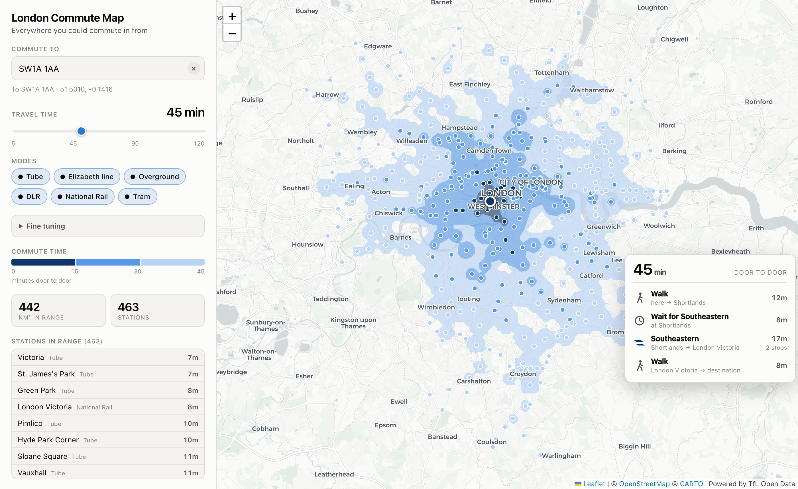

# London Commute Map

Give it a London postcode, station or address — a workplace, say — and a commute
length, and it shades every part of the city you could commute in from within
that time by public transport. Drag the time slider and the map redraws
immediately; drag the pin (or click the map) to move the destination.

**Hover anywhere** and you get the actual commute from that spot into your
address, leg by leg — walk, wait, ride, change, walk — with each line's roundel in
its own TfL colour, the minutes for every leg, and a door-to-door total. The legs
always add up to the total exactly.



## Running it

```bash
npm install
npm run build:network   # fetches the TfL network into public/network.json (~2 min)
npm run dev             # http://localhost:5173
```

`public/network.json` is committed, so `npm run dev` works without the fetch
step. Re-run `build:network` to pick up network changes (new stations, lines).

```bash
npm run build     # typecheck + production bundle into dist/
npm run preview   # serve the built output
```

`dist/` is a static site — no server, no API keys, no backend.

## How it works

Isochrones are computed **in the browser**, which is what makes the slider feel
instant. There are three stages:

**1. Build time — `scripts/build-network.mjs`.** Pulls the transport graph from
the [TfL Unified API](https://api-portal.tfl.gov.uk/): station coordinates and
line orderings from `/Line/{id}/Route/Sequence/{direction}`, and real
inter-station times by differencing the cumulative arrivals in
`/Line/{id}/Timetable/{stopId}`. It also derives out-of-station interchanges
(any two distinct stations within 450 m, so Bank↔Monument works). Output is a
~240 KB JSON graph: 804 stations, 34 lines, 2 205 edges.

**2. Routing — `src/engine.ts`.** Dijkstra over `(station, arriving line)`
states, so staying on a train is free while changing lines costs a penalty plus
the wait for the next service (half the line's headway). Seeded by walking from
your destination to every station in range. ~2 ms for the whole network. It also
keeps a predecessor per state, which is what lets a hovered point replay its
commute: pick the station that reaches the point soonest, walk the chain back,
group consecutive hops on one line into a single ride leg, then flip the whole
itinerary inbound.

Routing outward from the destination and presenting the result inbound is sound
because every edge and interchange in the graph is symmetric — the times are the
same in both directions. What isn't symmetric is the two walking limits, so they
are bound to the ends a commuter thinks in: one for the walk to their first stop,
one for the walk at the destination.

**3. Rasterise and contour — `src/worker.ts`.** Every reachable station stamps a
walking disc onto a 250 m grid over London, keeping the minimum — the
multi-source shortest walk. `turf.isobands` then contours that grid into
banded polygons (~40 ms). Both stages run in a Web Worker, and the Dijkstra
result is cached, so moving the time slider only re-rasterises.

## Accuracy

Checked against TfL's own journey planner, most station-to-station times land
within about 4 minutes:

| Journey | Model | Real |
|---|---|---|
| Walthamstow Central → Victoria | 25 min | ~21 min |
| King's Cross → Bank | 9.5 min | ~12 min |
| Paddington → Abbey Wood | 32 min | ~29 min |
| Richmond → Stratford | 54 min | ~50 min |
| King's Cross → Heathrow T5 | 46 min | ~55 min |

Known limits, in rough order of how much they matter:

- **TfL publishes timetables only for Tube, DLR and tram.** Overground,
  Elizabeth line and National Rail hops are estimated from distance using
  per-mode speeds calibrated against real journeys — 840 of 2 205 edges are
  timetabled, the rest estimated.
- **Branch frequencies aren't modelled.** Only some Piccadilly trains serve
  Heathrow T5, so branch destinations come out optimistic (the T5 row above).
- **Waits assume even headways** at a fixed service level rather than a real
  departure time, so this is a good guide, not a journey plan.
- **Buses are excluded.** They'd add a lot of coverage in outer London, but TfL
  publishes no usable timetable feed for ~700 routes.

## Dependencies

Everything is free and keyless. [Leaflet](https://leafletjs.com/) for the map,
[Turf](https://turfjs.org/) for contouring, [CARTO](https://carto.com/) basemap
tiles over OpenStreetMap data, [postcodes.io](https://postcodes.io/) for
postcode lookup, and [Nominatim](https://nominatim.openstreetmap.org/) for
addresses. Network data from the TfL Unified API — *Powered by TfL Open Data*.
